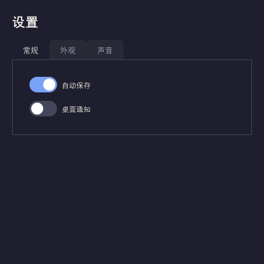

# Components

PawUI ships **17 built-in components** across layout, display, interaction, and logic. Every component supports animation attributes (`animate` / `duration` / `delay` / `easing`) and `expand`.



## Window

Root container, exactly one per file.

| Attribute | Type | Default | Notes |
|-----------|------|---------|-------|
| `title` | str | `"PawUI"` | Window title |
| `width` | int | `480` | Width (px) |
| `height` | int | `640` | Height (px) |
| `theme` | str | `"dark"` | `dark` / `light` |
| `padding` | int | `0` | Inner padding |
| `spacing` | int | `8` | Gap between children |

## Column / Row

Vertical / horizontal containers, same attributes.

| Attribute | Type | Default | Notes |
|-----------|------|---------|-------|
| `padding` | int / list | `12` | 1/2/4 values |
| `spacing` | int | `8` | Gap between children |
| `bg` | str | — | Background |
| `radius` | int | `24` | Corner radius |
| `expand` | bool | `false` | Stretch |
| `stagger` | int | `0` | Per-child animation delay (ms) |

## Scroll

| Attribute | Type | Default | Notes |
|-----------|------|---------|-------|
| `padding` | int / list | `12` | Inner padding |
| `spacing` | int | `8` | Gap |
| `bg` | str | — | Background |

## Tabs / Tab

Tabs. Children use `<Tab label="...">`.

| Attribute | Type | Default |
|-----------|------|---------|
| `bg` | str | `background` |

```html
<Tabs>
  <Tab label="Home"><Text>Home content</Text></Tab>
  <Tab label="Settings"><Text>Settings content</Text></Tab>
</Tabs>
```

## Tooltip

Wraps a child; shows a tooltip on hover.

| Attribute | Type | Notes |
|-----------|------|-------|
| `text` | str | Tooltip text (or as tag content) |

```html
<Tooltip text="Save the file">
  <Button on_click="save">Save</Button>
</Tooltip>
```

## Text

| Attribute | Type | Default | Notes |
|-----------|------|---------|-------|
| `size` | int | 12 | Font size (px); `font_size` also accepted |
| `bold` | bool | `false` | Bold |
| `italic` | bool | `false` | Italic |
| `color` / `fg` | str | `text` | Text color |

```html
<Text size="28" bold color="accent">Title</Text>
<Text color="subtext" size="12">Caption</Text>
<Text>Hello, {$name}</Text>
```

## Image

| Attribute | Type | Default | Notes |
|-----------|------|---------|-------|
| `src` | str | — | Path or source |
| `width` | int | native | Display width |
| `height` | int | native | Display height |
| `cover` | bool | `false` | Crop-to-fill |

```html
<Image src="assets/logo.png" width="120"/>
<Image src="assets/banner.jpg" width="400" height="200" cover/>
```

A missing image raises `RenderError: image not found: <src>`.

## Divider

| Attribute | Type | Default |
|-----------|------|---------|
| `thickness` | int | 2 |
| `color` | str | `border` |

## Spacer

| Attribute | Type | Default |
|-----------|------|---------|
| `width` | int | 1 |
| `height` | int | 1 |

## Progress

| Attribute | Type | Default | Notes |
|-----------|------|---------|-------|
| `value` | int | 0 | Current value; supports `{$x}` |
| `max` | int | 100 | Maximum |
| `height` | int | 10 | Height (px) |
| `text` | bool | `false` | Show percentage |
| `accent` | str | `accent` | Fill color |
| `bg` | str | `surface` | Track color |

```html
<Progress value="{$progress}" max="100" text/>
```

## Button

| Attribute | Type | Default | Notes |
|-----------|------|---------|-------|
| `on_click` | str | — | Click handler name |
| `bg` | str | `accent` | Background |
| `fg` | str | `background` | Text color |
| `size` | int | 12 | Font size |
| `radius` | int | 17 | Corner radius |
| `disabled` | bool | `false` | Disabled |

```html
<Button on_click="submit">Submit</Button>
<Button on_click="cancel" bg="surface" fg="text">Cancel</Button>
<Button bg="danger" fg="background">Delete</Button>
<Button disabled>Unavailable</Button>
```

## Input

Single-line input, self-closing.

| Attribute | Type | Default | Notes |
|-----------|------|---------|-------|
| `placeholder` | str | `""` | Placeholder |
| `value` | str | `""` | Initial value; supports `{$x}` |
| `on_change` | str | — | Calls `handler(text)` |
| `on_enter` | str | — | Calls `handler(text)` on Enter |
| `size` | int | 0 | Font size (0 = theme default) |
| `show` | str | — | Non-empty makes it a password field |
| `bind` | str | — | Two-way bind to a state key |

```html
<Input placeholder="Username" bind="username"/>
<Input placeholder="Search" on_change="search" expand/>
<Input show="password" bind="password" placeholder="Password"/>
```

## TextArea

Multi-line input, self-closing.

| Attribute | Type | Default | Notes |
|-----------|------|---------|-------|
| `placeholder` | str | — | Placeholder |
| `value` | str | — | Initial text; supports `{$x}` |
| `on_change` | str | — | `handler(text)` |
| `readonly` | bool | `false` | Read-only |
| `height` | int | — | Fixed height (px) |
| `size` | int | 14 | Font size |
| `bind` | str | — | Two-way bind |

```html
<TextArea placeholder="Write something..." height="120" bind="content"/>
```

## Checkbox

iOS-style toggle; label is the tag content.

| Attribute | Type | Default | Notes |
|-----------|------|---------|-------|
| `checked` | bool | `false` | Initial state |
| `on_change` | str | — | `handler(checked)` |
| `size` | int | 12 | Font size |
| `fg` | str | `text` | Label color |
| `bind` | str | — | Writes back to state |

```html
<Checkbox checked on_change="on_agree" bind="agreed">I agree</Checkbox>
```

## Slider

Horizontal slider, self-closing.

| Attribute | Type | Default | Notes |
|-----------|------|---------|-------|
| `min` | int | 0 | Minimum |
| `max` | int | 100 | Maximum |
| `step` | int | 1 | Step |
| `value` | int | `min` | Initial value; supports `{$x}` |
| `on_change` | str | — | `handler(value)` |
| `accent` | str | `accent` | Filled track color |
| `bg` | str | `border` | Track background |
| `bind` | str | — | Writes back to state |

```html
<Slider min="0" max="100" value="{$volume}" bind="volume" on_change="on_volume"/>
```

## Web

Embedded web view; requires `PySide6-Addons` (`pip install PySide6-Addons`).

| Attribute | Type | Notes |
|-----------|------|-------|
| `src` | str | URL to load |
| `html` | str | Inline HTML (used when `src` is empty) |
| `bg` | str | Background |

```html
<Web src="https://example.com"/>
```

## If

Logical container for conditional rendering. Produces no visible border.

| Attribute | Type | Notes |
|-----------|------|-------|
| `condition` | bool / ref | Renders children when truthy |

```html
<If condition="{$show_detail}">
  <Text>Details</Text>
</If>
```

## For

Logical container for list loops.

| Attribute | Type | Default | Notes |
|-----------|------|---------|-------|
| `each` | str | `"item"` | Loop variable name |
| `in` | list ref | — | List to iterate |

```html
<For each="task" in="{$tasks}">
  <Text>{$task.title}</Text>
</For>
```

## Composed example

```html
<Window title="Todos" width="440" height="560" theme="dark">
  <Column padding="24" spacing="16">
    <Text size="22" bold color="accent">Todo List</Text>

    <Row spacing="8">
      <Input bind="new_task" placeholder="Add a task..." on_enter="add" expand/>
      <Button on_click="add">Add</Button>
    </Row>

    <Divider/>

    <Scroll padding="0" spacing="8">
      <For each="task" in="{$tasks}">
        <Row spacing="12" padding="10" bg="surface" radius="10">
          <Checkbox bind="task.done">Done</Checkbox>
          <Text size="14" color="text">{$task.title}</Text>
        </Row>
      </For>
    </Scroll>

    <Progress value="{$done}" max="{$total}" text/>
  </Column>
</Window>

<script>
state.tasks = []
state.new_task = ""

def add():
    title = state.new_task.strip()
    if title:
        state.tasks = state.tasks + [{"title": title, "done": False}]
        state.new_task = ""

def done():
    return sum(1 for t in state.tasks if t.get("done"))

def total():
    return len(state.tasks)
</script>
```
