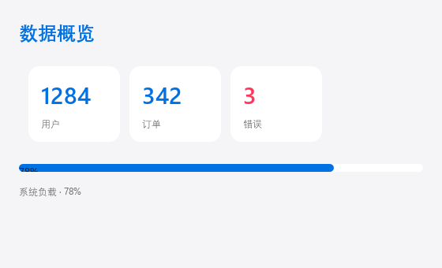

# Introduction

**PawUI** is a lightweight declarative UI library for Python. You describe the
interface in an HTML-like `.paw` file, write the logic in Python, and Qt
(PySide6) renders it natively.

No build step, no frontend toolchain, no hand-written `QWidget` boilerplate —
`pip install pawui` and run it.



## What problem it solves

Traditional Qt development means a lot of imperative code: create widgets, set
up layouts, connect signals, update the UI by hand. PawUI collapses all of that
into declarative syntax:

```html
<Window title="Greeter" width="360" height="200">
  <Column padding="24" spacing="12">
    <Text size="20" bold>Hello, {$name}</Text>
    <Input bind="name" placeholder="Enter a name" on_change="greet"/>
  </Column>
</Window>

<script>
state.name = "world"
def greet(text):
    state.name = text or "world"
</script>
```

When state changes the UI refreshes itself; event handlers are plain Python
functions.

## Core features

- **HTML-like syntax** — familiar tags and attributes, productive in minutes
- **Reactive state** — `{$name}` template binding, `state.name = ...` refreshes
- **44 built-in components + 2 logic containers** — layout, display, interaction, data and drawing
- **Native rendering** — Qt antialiasing, rounded corners, hover states, IME input
- **Two themes + custom colors** — `light` / `dark`, or define your own tokens
- **Entrance animation** — declarative fade / slide / reveal with easing and stagger
- **Hot reload** — `pawui watch app.paw`, rebuilds on save with state preserved
- **Script the page (DOM)** — `query` / `on` / `append` / `remove` / `inject_css` from Python
- **Script operations** — `on_click="save"` resolves to a script function; async work keeps the UI responsive

## Requirements

| Item | Requirement |
|------|-------------|
| Python | 3.10 or newer |
| Dependency | `PySide6 >= 6.5` |
| Platforms | Windows / macOS / Linux |

## A complete example

```html
<Window title="Counter" width="400" height="320" theme="light">
  <Column padding="32" spacing="16">
    <Text size="28" bold color="accent">Counter</Text>
    <Text size="48" bold>{$count}</Text>
    <Row spacing="12">
      <Button on_click="dec" bg="surface" fg="text">-</Button>
      <Button on_click="inc">+1</Button>
      <Button on_click="reset" bg="surface" fg="subtext">Reset</Button>
    </Row>
  </Column>
</Window>

<script>
state.count = 0

def inc():
    state.count = state.count + 1

def dec():
    state.count = max(0, state.count - 1)

def reset():
    state.count = 0
</script>
```

## Documentation map

- [Getting started](#/getting-started) — install and run your first app
- [Syntax](#/syntax) — tags, attributes, templates, control flow
- [Layout](#/layout) — containers, spacing and flex
- [Components](#/components) — all 44 components
- [State & scripts](#/state-scripts) — `state` and `<script>`
- [Events](#/events) — handlers, binding and async
- [Animation](#/animation) — entrance animation and easing
- [Theming](#/theming) — color tokens and customization
- [Custom components](#/custom-components) — `<Component>` and `<Prop>`
- [API reference](#/api) — Python interface
- [CLI](#/cli) — the `pawui` command
- [Examples](#/examples) — complete applications
- [FAQ](#/faq) — troubleshooting and pitfalls
