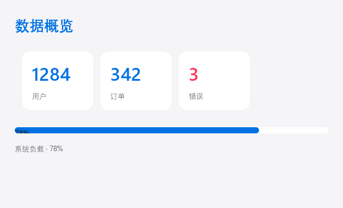

# Theming

PawUI ships `dark` / `light` themes and styles every component through **color tokens**. Override tokens or add your own named colors.

## Choosing a theme

Set it on `<Window>`:

```html
<Window theme="dark"> ... </Window>
<Window theme="light"> ... </Window>
```

The default is `dark`.




## Color tokens

| Token | dark default | light default | Use |
|-------|--------------|---------------|-----|
| `background` | `#1e1e2e` | `#f5f5f7` | Window background |
| `surface` | `#282a36` | `#ffffff` | Cards, inputs |
| `text` | `#f8f8f2` | `#1d1d1f` | Body text |
| `subtext` | `#a6adc8` | `#6e6e73` | Secondary text |
| `accent` | `#7aa2f7` | `#0071e3` | Accent |
| `border` | `#44475a` | `#d2d2d7` | Borders, dividers |
| `danger` | `#f7768e` | `#ff375f` | Danger / errors |

Use tokens directly in components:

```html
<Text color="text">Body</Text>
<Text color="subtext">Caption</Text>
<Text color="accent">Accent</Text>
<Text color="danger">Error</Text>
<Button bg="surface" fg="text">Secondary</Button>
```

Hex values work too:

```html
<Text color="#ff6b6b">Custom red</Text>
```

## Custom themes

Use a top-level `<Theme>` element. `extends` sets the base theme; `<Color>` overrides a token or defines a new color:

```html
<Theme extends="dark">
  <Color name="accent" value="#ff6b6b"/>
  <Color name="background" value="#0d0d12"/>
</Theme>

<Window title="My app">
  <Text color="accent">Custom accent</Text>
</Window>
```

- If `name` is a built-in token (`background`, ...), it overrides that token.
- Otherwise it becomes a **custom named color**, usable by name in components:

```html
<Theme extends="dark">
  <Color name="brand" value="#4ecdc4"/>
</Theme>

<Window>
  <Text color="brand">Brand text</Text>
  <Button bg="brand" fg="background">Brand button</Button>
</Window>
```

## Inheritance and precedence

Resolution order (later wins):

1. Default `dark`
2. Base theme from `<Window theme="...">`
3. Base theme from `<Theme extends="...">`
4. All `<Color>` overrides inside `</Theme>`

## Switching themes at runtime

```python
def toggle():
    app.set_theme("light" if state.dark else "dark")
    state.dark = not state.dark
```

```html
<Button on_click="toggle">Toggle theme</Button>
```

A window fade plays during the switch.

## Other theme parameters

Beyond colors, a theme carries spacing and typography (tunable from Python):

| Field | Default | Notes |
|-------|---------|-------|
| `spacing` | 8 | Default container gap |
| `padding` | 12 | Default container padding |
| `radius` | 24 | Default corner radius |
| `font_family` | `Segoe UI` | Font family |
| `font_size` | 12 | Default font size |
| `title_size` | 18 | Title size |

```python
from pawui.theme import Theme

theme = Theme.dark()
theme.accent = "#ff6b6b"
theme.radius = 12
app.set_theme(theme)
```

## Next

- [Components](#/docs/components) — color attributes per component
- [API Reference](#/docs/api) — the `Theme` class and `set_theme`
